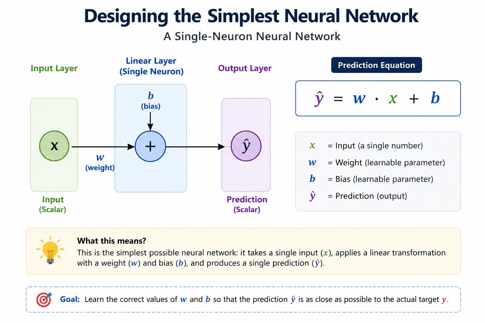
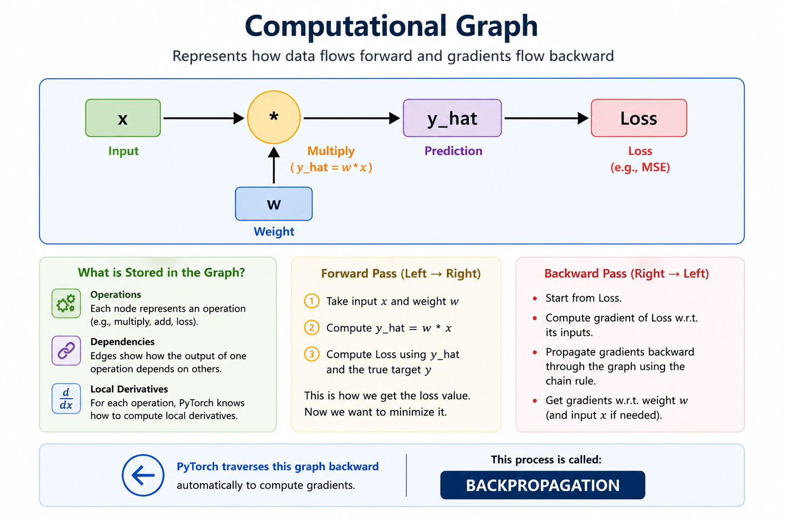

# Understanding Neural Networks From Scratch — Why PyTorch Matters

## Objective

In this blog, we will train a tiny neural network to learn a quadratic relationship.

We will implement the complete learning process twice:

1. Manually using mathematics and Python
2. Using PyTorch automatic differentiation

The goal is to understand:

- forward propagation
- loss computation
- derivatives
- gradients
- backpropagation
- learning rate updates
- why PyTorch simplifies deep learning

---

# Problem Statement

We want a model to learn:

y = x^2

Training samples:

| x | y |
|---|---|
| 1 | 1 |
| 2 | 4 |
| 3 | 9 |

---

# Step 1 — Designing the Simplest Neural Network

Architecture:




```text
Input x
   ↓
Linear Layer
   ↓
Prediction y_hat
```

Prediction equation:

```text
y_hat = w*x + b
```

Where:

- w = weight
- b = bias
- x = input
- y_hat = prediction

This is a single-neuron neural network.

---

# Important Observation

Our target function is quadratic:

```text
y = x^2
```

But our model is linear:

```text
y_hat = w*x + b
```

This is intentional.

The objective is to understand optimization and backpropagation.

---

# Step 2 — Initialize Parameters

Suppose:

```text
w = 0.5
b = 0.0
```

Take one training example:

```text
x = 2
y = 4
```

---

# Step 3 — Forward Propagation

The network computes prediction.

```text
y_hat = w*x + b
```

Substitute values:

```text
y_hat = (0.5)(2) + 0
y_hat = 1
```

Prediction:

```text
y_hat = 1
```

Actual value:

```text
y = 4
```

The prediction is poor.

---

# Step 4 — Loss Function

We use Mean Squared Error.

```text
L = (y - y_hat)^2
```

Substitute values:

```text
L = (4 - 1)^2
L = 9
```

Objective of training:

```text
L → 0
```

---

# Step 5 — The Core Question

We now ask:

```text
How should we change w and b
so that loss decreases?
```

This is where calculus enters deep learning.


---

# Step 6 — Derivative With Respect to Weight

Prediction equation:

```text
y_hat = w*x + b
```

Loss:

```text
L = (y - y_hat)^2
```

Substitute prediction equation:

```text
L = (y - (w*x+b))^2
```

We compute:

```text
dL/dw
```

using chain rule.

---

# Chain Rule Expansion

## Step A

Let:

```text
u = y - (w*x+b)
```

Then:

```text
L = u^2
```

Derivative:

```text
dL/du = 2u
```

---

## Step B

Derivative of:

```text
u = y - (w*x+b)
```

with respect to w:

```text
du/dw = -x
```

---

## Step C — Final Gradient

Using chain rule:

```text
dL/dw = (dL/du) * (du/dw)
```

Substitute:

```text
dL/dw = 2(y-y_hat)(-x)
```

---

# Numerical Gradient Computation

We had:

```text
y = 4
y_hat = 1
x = 2
```

Substitute:

```text
dL/dw = 2(4-1)(-2)
dL/dw = -12
```

Interpretation:

```text
Increasing w will reduce loss.
```

---

# Step 7 — Learning Rate and Weight Update

Gradient descent update rule:

```text
w_new = w_old - learning_rate * gradient
```

Suppose:

```text
learning_rate = 0.1
```

Substitute:

```text
w_new = 0.5 - 0.1(-12)
w_new = 1.7
```

The weight increased because the prediction was too small.

---

# Step 8 — Second Iteration

New weight:

```text
w = 1.7
```

Prediction:

```text
y_hat = (1.7)(2)
y_hat = 3.4
```

Loss:

```text
L = (4 - 3.4)^2
L = 0.36
```

The loss dramatically reduced.

---

# Step 9 — Third Iteration

Compute new gradient:

```text
dL/dw = 2(4-3.4)(-2)
dL/dw = -2.4
```

Update weight:

```text
w_new = 1.7 - 0.1(-2.4)
w_new = 1.94
```

Prediction:

```text
y_hat = (1.94)(2)
y_hat = 3.88
```

Loss:

```text
L = (4 - 3.88)^2
L = 0.0144
```

---

# Training Dynamics

| Iteration | Weight | Prediction | Loss |
|---|---|---|---|
| 1 | 0.5 | 1.0 | 9.0 |
| 2 | 1.7 | 3.4 | 0.36 |
| 3 | 1.94 | 3.88 | 0.0144 |

The network is learning.

---

# What We Did Manually

We manually implemented:

- forward propagation
- loss computation
- derivative calculation
- chain rule
- gradient descent
- parameter updates

Even for one neuron, this already becomes tedious.

Now imagine:

- millions of parameters
- hundreds of layers
- matrix calculus
- GPU execution

Manual differentiation becomes impractical.

---

# Enter PyTorch

PyTorch automates:

- gradient computation
- backpropagation
- tensor operations
- computational graphs

We now implement the SAME process using PyTorch.

---

# PyTorch Implementation

```python
import torch

# Training sample
x = torch.tensor([2.0])
y = torch.tensor([4.0])

# Initialize weight
w = torch.tensor([0.5], requires_grad=True)

learning_rate = 0.1

for iteration in range(3):

    # Forward pass
    y_hat = w * x

    # Loss
    loss = (y - y_hat) ** 2

    print(f"Iteration {iteration+1}")
    print("Prediction:", y_hat.item())
    print("Loss:", loss.item())

    # Backpropagation
    loss.backward()

    print("Gradient:", w.grad.item())

    # Weight update
    with torch.no_grad():
        w -= learning_rate * w.grad

    # Reset gradients
    w.grad.zero_()

    print("Updated Weight:", w.item())
    print("-------------------")
```

---

# What PyTorch Is Internally Doing

During:

```python
loss.backward()
```

PyTorch automatically computes:

```text
dL/dw
```

using automatic differentiation.

---

# Computational Graph




PyTorch stores:

- operations
- dependencies
- local derivatives

Then traverses graph backward.

This process is called:

```text
BACKPROPAGATION
```

---

# Why PyTorch Matters

Without PyTorch, engineers would need to manually derive:

- partial derivatives
- matrix gradients
- chain rule expansions
- optimization updates

for every architecture.

PyTorch automated calculus for deep learning.

---

# Final Intuition

A neural network is fundamentally:

```text
Prediction Function + Loss Function + Optimization
```

Training repeatedly performs:

1. prediction
2. error computation
3. gradient computation
4. parameter update

Core update equation:

```text
Parameters = Parameters - learning_rate * Gradient
```

This single idea powers modern deep learning.

---

# Key Takeaways

| Concept | Meaning |
|---|---|
| Forward Pass | Compute prediction |
| Loss Function | Measure prediction error |
| Gradient | Direction of steepest increase |
| Gradient Descent | Move opposite gradient |
| Backpropagation | Efficient gradient computation |
| Learning Rate | Step size |
| PyTorch | Automatic differentiation engine |

---

# Closing Thought

Deep learning is fundamentally:

```text
Linear Algebra + Calculus + Optimization + Software Engineering
```

PyTorch succeeded because it unified all four into a practical framework for large-scale learning.

